<!-- ==================== HERO ==================== -->


## ABOUT

Full Stack Software Engineer focused on building scalable web platforms,
secure backend systems and polished frontend experiences.

I work primarily with **Next.js**, **React**, **Laravel**, **TypeScript** and **PHP**,
turning complex product requirements into maintainable production systems.

> My engineering priorities are simple:
> clean architecture, predictable code, strong performance and software
> that remains easy to evolve.


## ENGINEERING PHILOSOPHY

<table>
<tr>
<td width="50%" valign="top">

- **Architecture over shortcuts** -- systems designed before code is written.
- **Security by default** -- hardened inputs, outputs and dependencies.
- **Performance with purpose** -- measured, never guessed.

</td>
<td width="50%" valign="top">

- **Maintainability at scale** -- code that stays easy to change.
- **Automation where it matters** -- CI/CD as a quality gate.
- **Simplicity over complexity** -- the fewest moving parts that work.

</td>
</tr>
</table>

## CORE EXPERTISE

<table>
<tr>
<td width="50%" valign="top">

### ENGINEERING SCOPE

```yaml
frontend:   Next.js / React / TypeScript
backend:    Laravel / PHP / REST APIs
data:       MySQL / MongoDB modeling
realtime:   WebSockets / event-driven systems
platform:   Docker / cloud deployment
quality:    testing / technical documentation
```

</td>
<td width="50%" valign="top">

### DELIVERY FOCUS

```yaml
architecture:   scalable and modular
security:       first-class concern
performance:    budget-driven UI and APIs
workflow:       reviewed, trunk-based flow
automation:     pipelines over manual toil
handover:       precise, maintained docs
```

</td>
</tr>
</table>


## TECHNOLOGY ECOSYSTEM


## FEATURED PROJECTS

<p align="center">
  <em>A curated selection of products and engineering work.</em>
</p>



#### `01` &#183; NAZEXA DB &nbsp; 

**Professional visual database design and schema management platform.**

Nazexa DB is a modern database design tool for visually creating, managing and documenting database schemas through an intuitive interactive interface -- from first sketch to production-ready migrations.

**KEY FEATURES**

- Visual database schema and ERD design
- Drag-and-drop table relationships and connections
- Support for multiple database technologies
- SQL, Prisma, Laravel and other schema import/export workflows
- Interactive diagrams with zoom, minimap, grid and auto-layout
- Table and column management -- data types, indexes, keys and relationships
- Modern collaborative developer-focused workflow

**STACK**


<br/>

<a href="https://nazexa.com/db-design">
  
</a>
&nbsp;
<a href="https://nazexa.com">
  
</a>


#### `02` &#183; NH Notification &nbsp; 

**Modern Laravel package for multi-channel notifications.**

Deliver email, SMS and push notifications through one clean, driver-based API designed for production workloads.

- Unified multi-channel delivery -- email, SMS and push
- Driver-based architecture with swappable channels
- Queue-ready dispatch with retry handling


<a href="https://github.com/nazmulhasan1010/nht-notification">
  
</a>


#### `03` &#183; Laravel File Manager &nbsp; 

**Modern storage and file management for Laravel applications.**

A complete file management layer that plugs into the Laravel storage ecosystem with a clean, modern interface.

- Full storage and directory management
- Fluid drag-and-drop interactions
- Laravel-native integration out of the box


<a href="https://github.com/nazmulhasan1010/laravel-file-manager">
  
</a>


#### `04` &#183; Pricing Card System &nbsp; 

**Responsive and reusable pricing interface components.**

Production-ready pricing UI built from reusable primitives with smooth, purposeful interaction design.

- Fully responsive across every breakpoint
- Smooth interactive animations
- Component-first architecture


<a href="https://github.com/nazmulhasan1010/Pricing-card">
  
</a>


#### `05` &#183; Chat Application &nbsp; 

**Realtime messaging platform built with a scalable architecture.**

A realtime chat system engineered around sockets, secure identity and a backend designed to grow with traffic.

- Socket.io realtime messaging layer
- Secure authentication flows
- Scalable backend design


<a href="https://github.com/nazmulhasan1010/chat-app">
  
</a>


## CONTRIBUTION ACTIVITY


<br/>


<!-- ==================== FOOTER ==================== -->

