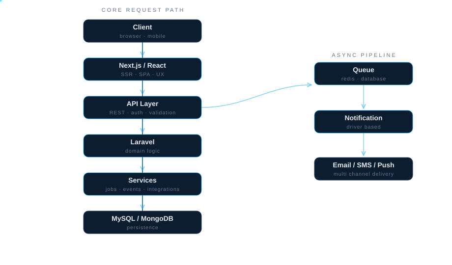

<!-- ==================== HERO ==================== -->


---

## CONNECT WITH ME

<p align="center">
  <a href="https://github.com/nazmulhasan1010">
    
  </a>
</p>

<p align="center">
  <a href="mailto:nazmulhasan169369@gmail.com">
    
  </a>
  <a href="https://linkedin.com/in/nazmulhasan1010">
    
  </a>
  <a href="https://www.npmjs.com/~nazmul_hasan_1010">
    
  </a>
  <a href="https://github.com/nazmulhasan1010">
    
  </a>
</p>


---

## ABOUT

Full Stack Software Engineer focused on building scalable web platforms,
secure backend systems and polished frontend experiences.

I work primarily with **Next.js**, **React**, **Laravel**, **TypeScript** and **PHP**,
turning complex product requirements into maintainable production systems.

> My engineering priorities are simple:
> clean architecture, predictable code, strong performance and software
> that remains easy to evolve.





## ENGINEERING PHILOSOPHY

<table>
<tr>
<td width="50%" valign="top">

- **Architecture over shortcuts** -- systems designed before code is written.
- **Security by default** -- hardened inputs, outputs and dependencies.
- **Performance with purpose** -- measured, never guessed.

</td>
<td width="50%" valign="top">

- **Maintainability at scale** -- code that stays easy to change.
- **Automation where it matters** -- CI/CD as a quality gate.
- **Simplicity over complexity** -- the fewest moving parts that work.

</td>
</tr>
</table>

## CORE EXPERTISE

<table>
<tr>
<td width="50%" valign="top">

### ENGINEERING SCOPE

```yaml
frontend:   Next.js / React / TypeScript
backend:    Laravel / PHP / REST APIs
data:       MySQL / MongoDB modeling
realtime:   WebSockets / event-driven systems
platform:   Docker / cloud deployment
quality:    testing / technical documentation
```

</td>
<td width="50%" valign="top">

### DELIVERY FOCUS

```yaml
architecture:   scalable and modular
security:       first-class concern
performance:    budget-driven UI and APIs
workflow:       reviewed, trunk-based flow
automation:     pipelines over manual toil
handover:       precise, maintained docs
```

</td>
</tr>
</table>




## TECHNOLOGY ECOSYSTEM




## FEATURED PROJECTS

#### `01` &#183; NH Notification &nbsp; 

**Modern Laravel package for multi-channel notifications.**

- Multi-channel delivery -- email, SMS and push notifications
- Driver-based architecture with production-ready design
- Queue-ready dispatch out of the box


<a href="https://github.com/nazmulhasan1010/nht-notification">
  
</a>


#### `02` &#183; Laravel File Manager &nbsp; 

**Storage management with a modern interface.**

- Full storage and directory management
- Drag-and-drop interactions with a modern UI
- Built natively for the Laravel ecosystem


<a href="https://github.com/nazmulhasan1010/laravel-file-manager">
  
</a>


#### `03` &#183; Pricing Card System &nbsp; 

**Responsive pricing components built from reusable primitives.**

- Responsive UI across every breakpoint
- Animation-driven interactions
- Reusable component-first design


<a href="https://github.com/nazmulhasan1010/Pricing-card">
  
</a>


#### `04` &#183; Chat Application &nbsp; 

**Realtime messaging platform at scale.**

- Realtime messaging over Socket.io
- Secure authentication flows
- Scalable backend architecture


<a href="https://github.com/nazmulhasan1010/chat-app">
  
</a>


## GITHUB PERFORMANCE

<div align="center">


&nbsp;


<br/>


</div>

## CONTRIBUTION ACTIVITY


<br/>


## SUPPORT MY WORK

<p align="center">
  <a href="https://buymeacoffee.com/nazmulhasan1010">
    
  </a>
</p>

<!-- ==================== FOOTER ==================== -->

